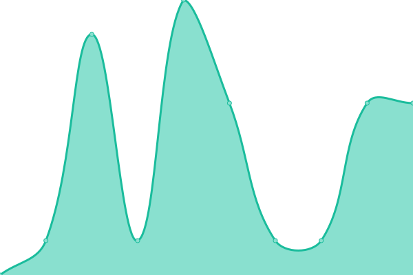
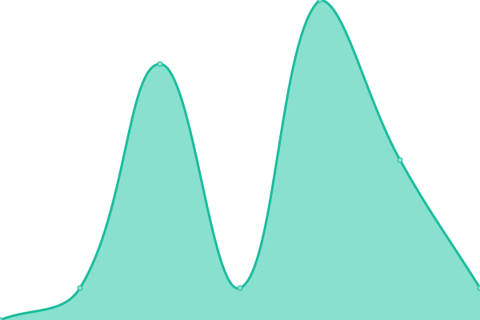

# [📈 Live Status](https://status.roswellit.com): <!--live status--> **🟩 All systems operational**

This repository contains the open-source uptime monitor and status page for [Roswell IT](https://www.roswellit.com), powered by [Upptime](https://github.com/upptime/upptime).

With [Upptime](https://upptime.js.org), you can get your own unlimited and free uptime monitor and status page, powered entirely by a GitHub repository. We use [Issues](https://github.com/roswellit/status/issues) as incident reports, [Actions](https://github.com/roswellit/status/actions) as uptime monitors, and [Pages](https://status.roswellit.com) for the status page.

<!--start: status pages-->
<!-- This summary is generated by Upptime (https://github.com/upptime/upptime) -->
<!-- Do not edit this manually, your changes will be overwritten -->
<!-- prettier-ignore -->
| URL | Status | History | Response Time | Uptime |
| --- | ------ | ------- | ------------- | ------ |
|  [www.roswellit.com](https://roswellit.com) | 🟩 Up | [www-roswellit-com.yml](https://github.com/roswellit/status/commits/HEAD/history/www-roswellit-com.yml) | 

 1878ms
     
 | 

<a href="https://status.roswellit.com/history/www-roswellit-com">100.00%</a>
    

|  [portal.roswellit.com](https://roswell.myportallogin.co.uk) | 🟩 Up | [portal-roswellit-com.yml](https://github.com/roswellit/status/commits/HEAD/history/portal-roswellit-com.yml) | 

 741ms
     
 | 

<a href="https://status.roswellit.com/history/portal-roswellit-com">100.00%</a>
    

|  [help.roswellit.com](https://roswellitservices.hostedrmm.com:8040/) | 🟩 Up | [help-roswellit-com.yml](https://github.com/roswellit/status/commits/HEAD/history/help-roswellit-com.yml) | 

 1616ms
     
 | 

<a href="https://status.roswellit.com/history/help-roswellit-com">99.63%</a>
    

|  [HVS - Platform](dm.yourwhc.co.uk) | 🟩 Up | [hvs-platform.yml](https://github.com/roswellit/status/commits/HEAD/history/hvs-platform.yml) | 

 484ms
     
 | 

<a href="https://status.roswellit.com/history/hvs-platform">100.00%</a>
    

|  [HVS - Office UC](officeuc.yourwhc.co.uk) | 🟩 Up | [hvs-office-uc.yml](https://github.com/roswellit/status/commits/HEAD/history/hvs-office-uc.yml) | 

 374ms
     
 | 

<a href="https://status.roswellit.com/history/hvs-office-uc">100.00%</a>
    

|  [HVS - Go TAPI Integrator](applications.yourwhc.co.uk) | 🟩 Up | [hvs-go-tapi-integrator.yml](https://github.com/roswellit/status/commits/HEAD/history/hvs-go-tapi-integrator.yml) | 

 390ms
     
 | 

<a href="https://status.roswellit.com/history/hvs-go-tapi-integrator">100.00%</a>
    

|  [Google Public Recursive DNS](8.8.8.8) | 🟩 Up | [google-public-recursive-dns.yml](https://github.com/roswellit/status/commits/HEAD/history/google-public-recursive-dns.yml) | 

 5ms
     
 | 

<a href="https://status.roswellit.com/history/google-public-recursive-dns">100.00%</a>
    

|  [CloudFlare Public Recursive DNS](1.1.1.1) | 🟩 Up | [cloud-flare-public-recursive-dns.yml](https://github.com/roswellit/status/commits/HEAD/history/cloud-flare-public-recursive-dns.yml) | 

 6ms
     
 | 

<a href="https://status.roswellit.com/history/cloud-flare-public-recursive-dns">100.00%</a>
    

|  [Remote Monitoring & Management](https://roswellitservices.hostedrmm.com) | 🟩 Up | [remote-monitoring-and-management.yml](https://github.com/roswellit/status/commits/HEAD/history/remote-monitoring-and-management.yml) | 

 718ms
     
 | 

<a href="https://status.roswellit.com/history/remote-monitoring-and-management">99.63%</a>
    

<!--end: status pages-->

[**Visit our status website →**](https://status.roswellit.com)

## 📄 License

- Powered by: [Upptime](https://github.com/upptime/upptime)
- Code: [MIT](./LICENSE) © [Roswell IT](https://www.roswellit.com)
- Data in the `./history` directory: [Open Database License](https://opendatacommons.org/licenses/odbl/1-0/)
